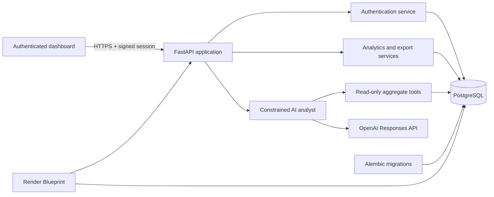

# Loyalty Analytics AI Agent

[](https://github.com/fetachino/loyalty-analytics-agent/actions/workflows/ci.yml)
[](https://www.python.org/)
[](https://fastapi.tiangolo.com/)
[](https://loyalty-analytics-agent.onrender.com)

A production-style loyalty intelligence platform that turns customer, transaction, and reward
data into an authenticated executive dashboard and grounded AI-assisted analysis.

**[Open the live demo](https://loyalty-analytics-agent.onrender.com)** ·
**[Explore the API docs](https://loyalty-analytics-agent.onrender.com/docs)** ·
**[Read the portfolio case study](docs/portfolio.md)**

> The demo runs on Render's free tier. Its first request after inactivity can take about a minute
> while the service wakes up.

## What it demonstrates

- A layered FastAPI backend with async-ready SQLAlchemy 2.x patterns and PostgreSQL
- Versioned database migrations and deterministic demo-data bootstrapping
- Secure administrator authentication with Argon2 password hashing and signed HttpOnly cookies
- Responsive executive analytics for revenue, loyalty tiers, and reward activity
- Paginated REST resources and streamed CSV exports with spreadsheet-injection protection
- A constrained AI analyst that can call only approved, read-only aggregate tools
- A durable LangGraph workflow with routing, retries, PostgreSQL checkpoints, and audited approval
- Per-user analysis history, configurable rate limiting, and graceful provider error handling
- Production deployment through a Render Blueprint with health probes and structured logs
- Automated formatting, linting, strict typing, tests, coverage enforcement, and container builds
- A versioned agent evaluation suite with safety cases, structured judging, and OpenTelemetry spans

The deployed demo contains **100 customers, 1,000 transactions, and 100 reward redemptions**.

## Architecture



The AI layer never receives arbitrary SQL access. It selects from four server-owned aggregate
tools; those tools validate inputs and execute controlled queries. Individual customer records
are intentionally unavailable to the model.

## Technology

| Area | Technologies |
| --- | --- |
| API | Python 3.12, FastAPI, Pydantic v2 |
| Data | PostgreSQL, SQLAlchemy 2.x, Alembic |
| AI | OpenAI Responses API with constrained function tools |
| Security | Argon2, signed HttpOnly cookies, security headers, rate limiting |
| UI | Responsive HTML, CSS, and JavaScript served by FastAPI |
| Operations | Docker, Docker Compose, Render Blueprint, health probes |
| Quality | pytest, pytest-cov, Ruff, mypy, GitHub Actions |

## Quick start with Docker

Requirements: Docker with Compose v2 and an OpenAI API key if you want to use the AI analyst.

```bash
cp .env.example .env
docker compose up --build -d
docker compose exec api alembic upgrade head
docker compose exec api python scripts/seed.py
docker compose exec api python scripts/create_admin.py --email you@example.com
```

The dashboard is at <http://localhost:8000> and interactive OpenAPI documentation is at
<http://localhost:8000/docs>.

Administrators also receive a **Manage data** workspace in the dashboard for creating and updating
customers, recording purchases, and redeeming rewards. These forms use the protected
data-management API and keep points changes tied to transaction or redemption records.

Generate a strong signing key and set it as `AUTH_SECRET_KEY` in `.env`:

```bash
python -c "import secrets; print(secrets.token_urlsafe(48))"
```

Set `OPENAI_API_KEY` in the same untracked file to enable AI analysis. Never commit either secret.

Stop services with `docker compose down`. Use `docker compose down -v` only when you also intend
to remove the local database volume.

## Local development

Create a Python 3.12 virtual environment, then run:

```bash
python -m pip install -e ".[dev]"
cp .env.example .env
alembic upgrade head
python scripts/seed.py
uvicorn loyalty_analytics.main:app --reload
```

`DATABASE_URL` must point to a reachable PostgreSQL database. The deterministic seed replaces
existing loyalty records and is intended only for development or demonstration environments.

## API surface

| Method | Path | Purpose |
| --- | --- | --- |
| `GET` | `/health`, `/health/live`, `/health/ready` | Health and platform probes |
| `GET` | `/api/v1/customers` | Paginated customers |
| `GET` | `/api/v1/customers/{id}` | Customer by UUID |
| `GET` | `/api/v1/transactions` | Paginated transactions |
| `GET` | `/api/v1/rewards` | Paginated reward redemptions |
| `POST` | `/api/v1/admin/customers` | Create a customer (administrator only) |
| `PATCH` | `/api/v1/admin/customers/{id}` | Update customer profile data (administrator only) |
| `POST` | `/api/v1/admin/transactions` | Record a purchase and credit points (administrator only) |
| `POST` | `/api/v1/admin/rewards` | Redeem a reward and deduct points (administrator only) |
| `GET` | `/api/v1/analytics/overview` | Program-wide KPIs |
| `GET` | `/api/v1/analytics/loyalty-tiers` | Membership metrics by tier |
| `GET` | `/api/v1/analytics/spending-by-category` | Revenue metrics by category |
| `GET` | `/api/v1/analytics/reward-redemptions` | Redemption metrics by reward |
| `POST` | `/api/v1/agent/query` | Ask a grounded analytics question |
| `POST` | `/api/v1/agent/workflows/{id}/approval` | Resume a sensitive workflow |
| `GET` | `/api/v1/agent/history` | Retrieve the signed-in user's analyses |
| `GET` | `/api/v1/exports/*.csv` | Stream summary or resource reports |
| `POST` | `/api/v1/auth/login`, `/api/v1/auth/logout` | Manage a dashboard session |
| `GET` | `/api/v1/auth/me` | Retrieve the authenticated user |

Collection endpoints accept `page` (default `1`) and `page_size` (default `20`, maximum `100`).
They return `items`, `total`, `page`, `page_size`, and `pages`. Validation failures use structured
`422` responses, unknown resources return `404`, and unexpected failures include an
`X-Request-ID` correlation value.

Customer, transaction, reward, analytics, export, and AI routes require authentication. Health
probes and static login assets remain public.

Data-management routes require an administrator session. Transaction and reward writes lock the
affected customer row and update the points balance in the same database transaction. Customer
points cannot be edited directly, which preserves the transaction and redemption audit trail.

## Security and operational choices

- Passwords are Argon2-hashed and are never logged or stored in plaintext.
- Sessions use signed HttpOnly, SameSite cookies; production requires secure cookies over HTTPS.
- CSV values with spreadsheet formula prefixes are escaped before streaming.
- AI requests are rate-limited and restricted to aggregate, read-only business tools.
- Every response receives defensive browser headers and an `X-Request-ID`.
- Request logs are structured JSON with method, path, status, and duration.
- Secrets are injected through environment variables and `.env` is excluded from version control.

See [SECURITY.md](SECURITY.md) for reporting and credential-handling guidance.

The agent's golden dataset, deterministic regression scoring, optional structured LLM judge, and
privacy-conscious tracing design are documented in [the evaluation guide](docs/evaluations.md).
The routing graph and human-in-the-loop safety boundary are documented in
[the workflow guide](docs/workflow.md).

## Quality gates

```bash
make format
make lint
make typecheck
make test
# all non-mutating checks
make check
```

GitHub Actions runs formatting verification, linting, strict type checking, tests with coverage,
and a production container build for pull requests and pushes to `main`. Tests use an isolated
SQLite database; production uses PostgreSQL. Schema changes are applied through Alembic.

## Deployment

`render.yaml` provisions the Docker web service and managed PostgreSQL database, generates the
session secret, runs migrations, bootstraps an administrator, and seeds an empty demo database.
See [the deployment runbook](docs/deployment.md) for configuration and free-tier limitations.

### Snowflake analytics

The dashboard and AI tools can read aggregate metrics from Snowflake while PostgreSQL remains the
system of record and automatic fallback. Run `infra/snowflake/bootstrap.sql` in Snowsight after
replacing `YOUR_SNOWFLAKE_USERNAME`, configure the `SNOWFLAKE_*` secrets, run
`python scripts/sync_snowflake.py`, and set `ANALYTICS_PROVIDER=snowflake`.
The bootstrap grants the application role synchronization access to existing and future analytics
tables so scheduled data refreshes remain operational as the schema grows.

The warehouse is X-Small, starts suspended, and auto-suspends after 60 seconds. The authenticated
`GET /api/v1/integrations/snowflake/health` endpoint verifies the deployed connection. Never
commit Snowflake credentials; for long-lived production use, migrate from a password to key-pair
authentication.

On a private hosted network where an interactive shell is unavailable, set
`SNOWFLAKE_SYNC_ON_START=true` for one deployment to copy PostgreSQL data into Snowflake. Confirm
the `Synced ... to Snowflake` log entry, then immediately restore the flag to `false`.

For ongoing synchronization, `.github/workflows/snowflake-sync.yml` calls a narrowly scoped,
token-protected Render endpoint every day at 07:17 UTC and also supports manual runs. Set the same
random value as Render's `SNOWFLAKE_SYNC_TOKEN` and the GitHub Actions repository secret
`RENDER_SYNC_TOKEN`. The workflow receives no database or Snowflake credentials.

### Snowflake key-pair authentication

For deployed environments, generate an encrypted key pair outside the repository with
`python scripts/generate_snowflake_keypair.py --output-directory <secure-directory>`. Register
only the public key with the Snowflake user. Store the encrypted `.p8` private key as a Render
secret file, then set `SNOWFLAKE_PRIVATE_KEY_FILE` and `SNOWFLAKE_PRIVATE_KEY_PASSPHRASE`.
Key-pair settings take precedence over `SNOWFLAKE_PASSWORD`, allowing a verified migration before
the password is removed.

### S3-compatible analytics snapshots

Authenticated administrators can write aggregate-only JSON snapshots through the AWS S3 API with
`POST /api/v1/object-storage/snapshots`, audit them with `GET /api/v1/object-storage/snapshots`,
and request a 15-minute download URL. Snapshots intentionally exclude customer-level PII.

Local development uses MinIO at `http://localhost:9001`. The same `boto3` implementation supports
AWS S3 or an S3-compatible provider by changing `OBJECT_STORAGE_ENDPOINT_URL`, bucket, region, and
credentials. No AWS resource is required for local development, and no AWS account is configured
by this repository.

## Project layout

```text
src/loyalty_analytics/         application, models, schemas, routes, and services
src/loyalty_analytics/static/  responsive dashboard and AI analyst interface
migrations/                    Alembic environment and versioned migrations
scripts/                       seed, bootstrap, and administrator utilities
tests/                         API, service, configuration, and security tests
docs/                          deployment runbook and portfolio case study
.github/workflows/ci.yml       continuous integration quality gates
Dockerfile                     non-root, multi-stage production image
compose.yaml                   local API and PostgreSQL services
render.yaml                    managed deployment Blueprint
```

## Project status

Version 1.0 is a complete portfolio release: backend, analytics, AI analyst, dashboard,
authentication, exports, CI, and hosted deployment are operational. Future iterations could add
multi-tenant organizations, background ingestion pipelines, richer observability, and durable
distributed rate limiting.
