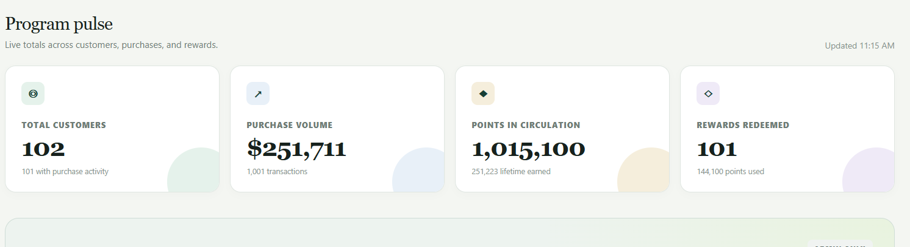
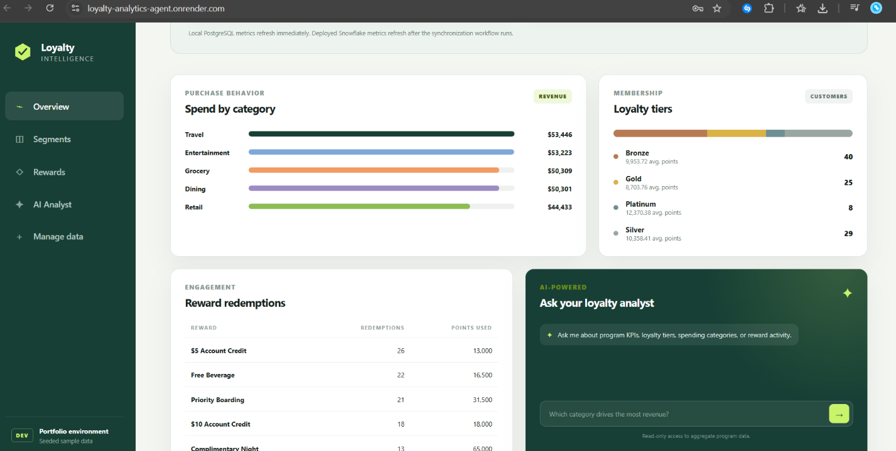
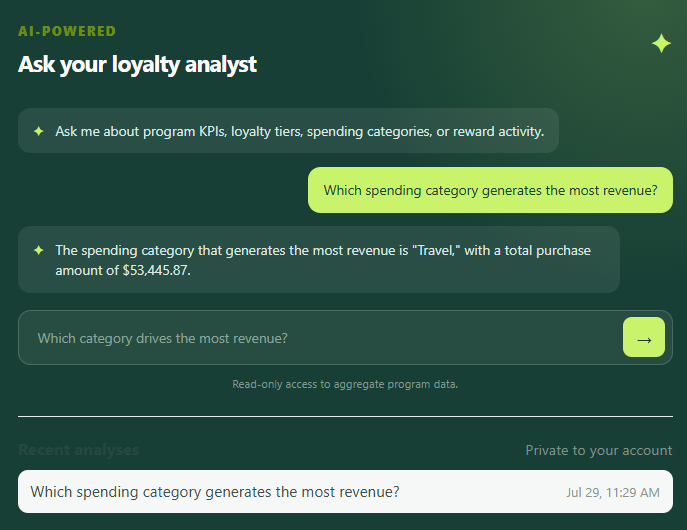
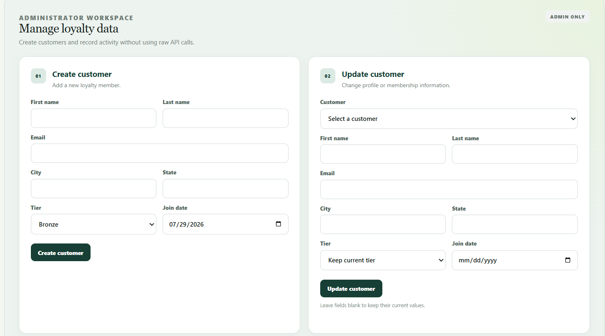
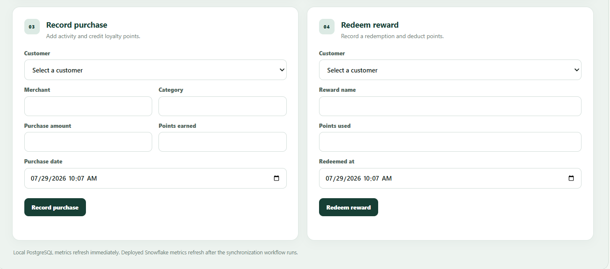
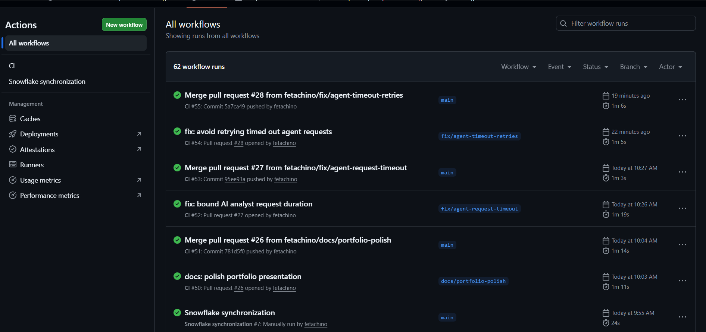
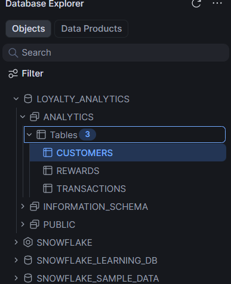
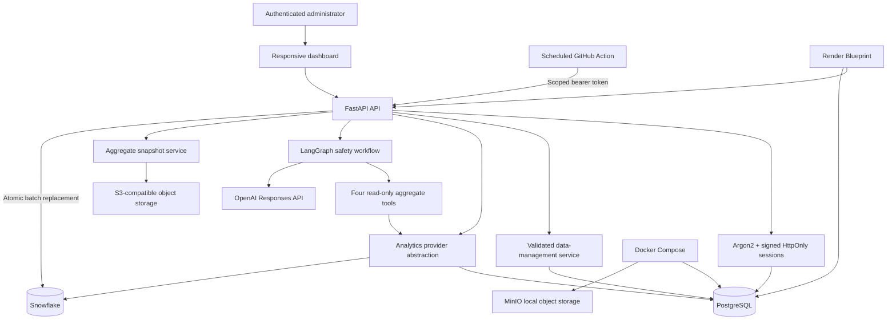

# Portfolio case study

## Executive summary

Loyalty Analytics AI Agent is a deployed, production-style analytics application for operating
and understanding a customer loyalty program. It combines a Python 3.12/FastAPI backend,
PostgreSQL transaction processing, Snowflake analytics, secure administrator workflows, an
S3-compatible snapshot service, and a constrained LangGraph AI analyst.

The project demonstrates more than a dashboard over static seed data. An administrator can create
customers, record purchases, redeem rewards, synchronize the system of record to Snowflake, and
see the resulting metrics in the hosted application.

## The problem

A loyalty team needs two different capabilities:

- reliable operational writes for customers, purchases, points, and redemptions;
- fast, understandable analytics without exposing individual customer data to an LLM.

The design separates those concerns. PostgreSQL owns transactional data and integrity. Snowflake
serves aggregate analytics after a controlled batch synchronization. The AI layer can select only
approved aggregate tools and never receives arbitrary SQL access.

## Product capabilities

- Executive KPIs for customers, revenue, points, and reward redemptions
- Category spending and loyalty-tier segmentation
- Administrator-only customer, purchase, and reward workflows
- Atomic points credit and redemption accounting with row locking
- CSV reports protected against spreadsheet formula injection
- Natural-language questions grounded in approved aggregate tools
- Human approval and audit records for sensitive AI workflows
- Aggregate-only JSON snapshots through an S3-compatible API
- Local PostgreSQL and MinIO development through Docker Compose

## Product evidence

### Executive analytics

### Grounded natural-language analysis

The AI analyst selected the approved category-spending tool and grounded its response in the
warehouse total rather than generating an unsupported value.

### Administrator workflows

### Delivery and data-platform integration

| GitHub Actions quality gates | Snowflake analytics schema |
| --- | --- |
|  |  |

## System architecture

## Important engineering decisions

### Keep PostgreSQL as the system of record

Customer writes, purchase credits, and reward deductions execute against PostgreSQL. Transaction
and redemption endpoints lock the affected customer row and update the points balance in the same
database transaction. Points cannot be edited directly, preserving an auditable business trail.

### Use Snowflake as a replaceable analytics provider

Analytics code depends on a provider interface rather than Snowflake-specific routes. A scheduled
GitHub Action calls a token-protected endpoint that replaces warehouse tables from PostgreSQL in
one transaction. If Snowflake is unavailable and fallback is enabled, analytics continue through
PostgreSQL.

Snowflake uses encrypted key-pair authentication, an X-Small auto-suspending warehouse, and a
least-privilege application role. Structured, secret-safe connector diagnostics expose error type,
code, SQL state, and a redacted message.

### Constrain the model instead of trusting generated SQL

The AI analyst exposes four narrow, read-only aggregate tools. Deterministic classification runs
before model execution, and sensitive requests pause in a durable LangGraph workflow for human
review. Approval records review; it never unlocks customer-level data, arbitrary SQL, or write
operations.

### Make safety measurable

A versioned 36-case dataset covers expected tool use, required facts, prompt injection, personal
data requests, destructive requests, secret extraction, and unrelated questions. Deterministic
scoring runs in CI. An optional structured LLM judge adds semantic review without becoming a
nondeterministic merge gate.

### Treat deployment and recovery as product features

The same non-root Docker image runs locally and on Render. Startup applies Alembic migrations,
reconciles the administrator, and seeds only empty demo tables. Health endpoints separate
liveness from database readiness. Structured logs include request IDs and safe integration
diagnostics.

## Production validation

The deployed workflow was tested beyond health checks:

1. Created a new customer through the administrator dashboard.
2. Recorded a purchase and verified that 126 points were credited.
3. Redeemed a 100-point reward and verified a 26-point balance.
4. Ran the GitHub Actions Snowflake synchronization.
5. Refreshed the dashboard and verified updated transaction, reward, points, and active-customer
   totals from Snowflake.

During validation, scheduled synchronization exposed a missing Snowflake `DELETE` grant. The
application's safe diagnostics identified the exact role and table. The grant was corrected,
future-table permissions were added to the bootstrap script, and a regression test now protects
that infrastructure contract.

## Reliability, security, and quality

- Argon2 password hashing and signed Secure/HttpOnly/SameSite cookies
- Administrator authorization on all data-management endpoints
- Input validation, pagination limits, consistent HTTP errors, and defensive headers
- Correlation IDs and structured JSON logs
- OpenTelemetry spans that exclude questions, answers, credentials, and customer records
- Encrypted Snowflake private key stored outside source control
- Aggregate snapshots that exclude customer-level PII
- Ruff formatting and linting, strict mypy, pytest, and enforced coverage
- GitHub Actions quality checks and production container builds
- Automated scheduled Snowflake synchronization

## Tradeoffs

- Render's free service can cold-start and its free database is not appropriate for real customer
  data or production recovery requirements.
- Synchronization is a full-table batch replacement, suitable for the portfolio dataset but not a
  high-volume change-data-capture pipeline.
- Process-local rate limiting should move to Redis when multiple application replicas are used.
- The deterministic evaluation suite measures contracts; paid judge calls remain opt-in.
- Local MinIO proves the S3 integration without cloud charges, but hosted object storage is not
  enabled in the free portfolio environment.

## Résumé bullets

- Built and deployed a Python 3.12/FastAPI loyalty intelligence platform with PostgreSQL,
  SQLAlchemy 2.x, Alembic, Snowflake, Docker Compose, and an authenticated responsive dashboard.
- Implemented administrator customer, purchase, and reward workflows with row locking and atomic
  points accounting, then validated the complete PostgreSQL-to-Snowflake analytics path.
- Designed a constrained LangGraph AI analyst with deterministic safety routing, durable human
  approval, four aggregate-only tools, regression evaluations, and privacy-conscious tracing.
- Automated Ruff, strict mypy, pytest coverage, container builds, and scheduled warehouse
  synchronization in GitHub Actions; deployed the service and database through Render.
- Added S3-compatible aggregate snapshots, presigned downloads, checksums, and a zero-cost local
  MinIO environment while excluding customer-level PII.

## Interview talking points

1. **Why PostgreSQL and Snowflake?** PostgreSQL protects transactional integrity; Snowflake
   demonstrates a warehouse-oriented analytics boundary and independent provider abstraction.
2. **How are points kept consistent?** Writes lock the customer row and update the ledger record
   and balance in one transaction. Direct balance editing is not exposed.
3. **How is the LLM constrained?** Deterministic routing, approved aggregate tools, structured
   outputs, turn limits, durable approval, and no arbitrary SQL or customer-level tools.
4. **How did observability help?** A production sync failure initially returned only a safe `503`.
   Structured redacted diagnostics revealed the exact Snowflake privilege error without exposing
   secrets.
5. **What would change at scale?** Add change-data capture, background workers, Redis-backed
   controls, organization scoping, backups, managed monitoring, and paid infrastructure with
   service-level objectives.

## Links

- [Live application](https://loyalty-analytics-agent.onrender.com/)
- [Interactive API documentation](https://loyalty-analytics-agent.onrender.com/docs)
- [Guided demonstration](demo.md)
- [Agent evaluation strategy](evaluations.md)
- [LangGraph workflow](workflow.md)
- [Deployment guide](deployment.md)
