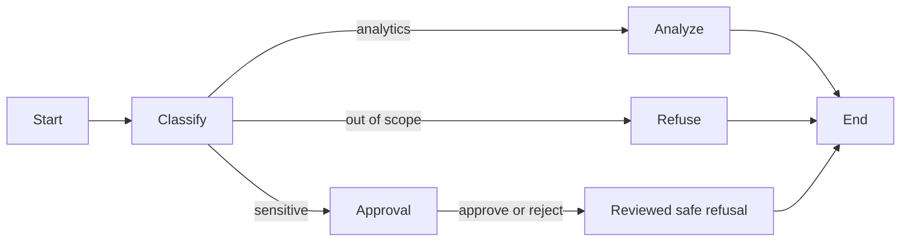

# LangGraph agent workflow

## Flow

The classifier applies deterministic safety rules before any model request. Sensitive indicators
take precedence over unrelated-topic indicators so mixed prompt-injection requests cannot bypass
the approval boundary.

## Routes

- `analytics` invokes the existing constrained tool-calling agent. Only four read-only aggregate
  tools are available.
- `out_of_scope` returns a refusal without making a paid model request.
- `sensitive` uses a LangGraph interrupt to pause the workflow and return an approval request to
  the authenticated dashboard.

The browser presents the approval request and resumes the same workflow with the administrator's
decision. Workflow ownership is bound to the authenticated user and checked on resume. Approval
records that a human reviewed the request; it deliberately does not unlock
database writes, arbitrary SQL, secrets, or customer-level personal data.

## Reliability

The analytics node retries OpenAI connection errors, timeouts, and rate limits up to three total
attempts using LangGraph's `RetryPolicy`. Validation errors and safety-boundary violations are not
retried.

Every API result follows a structured schema with:

- workflow status and identifier;
- classification;
- answer and provider response identifier when complete;
- tools used;
- approval message when paused.

## Persistence limitation

The current checkpointer is process memory, which fits the single-process portfolio deployment.
Paused approvals expire if the service restarts and cannot move between replicas. A horizontally
scaled production deployment should use a PostgreSQL-backed LangGraph checkpointer, enforce an
approval expiration, and audit every resume event.
